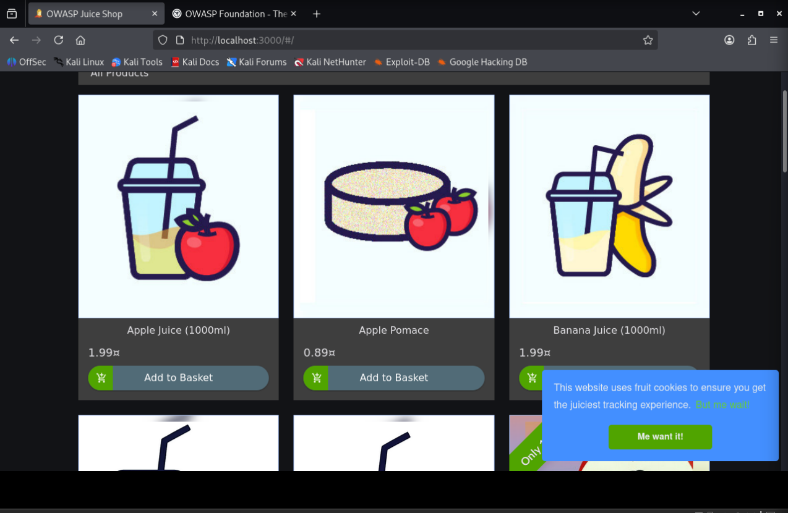
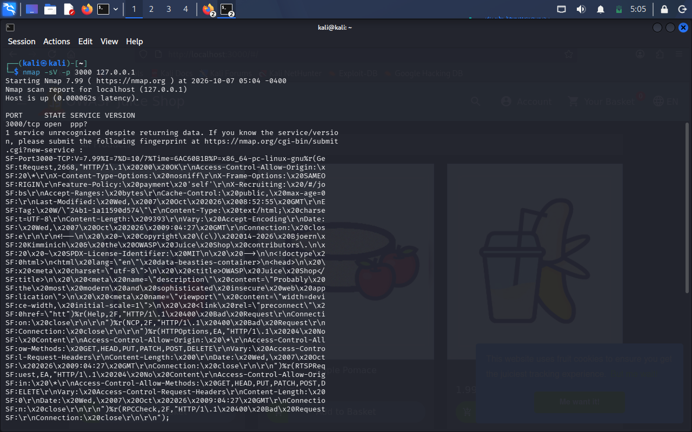
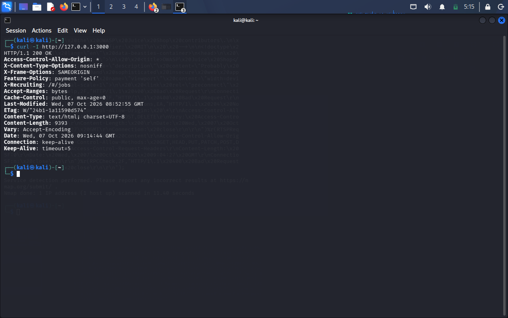
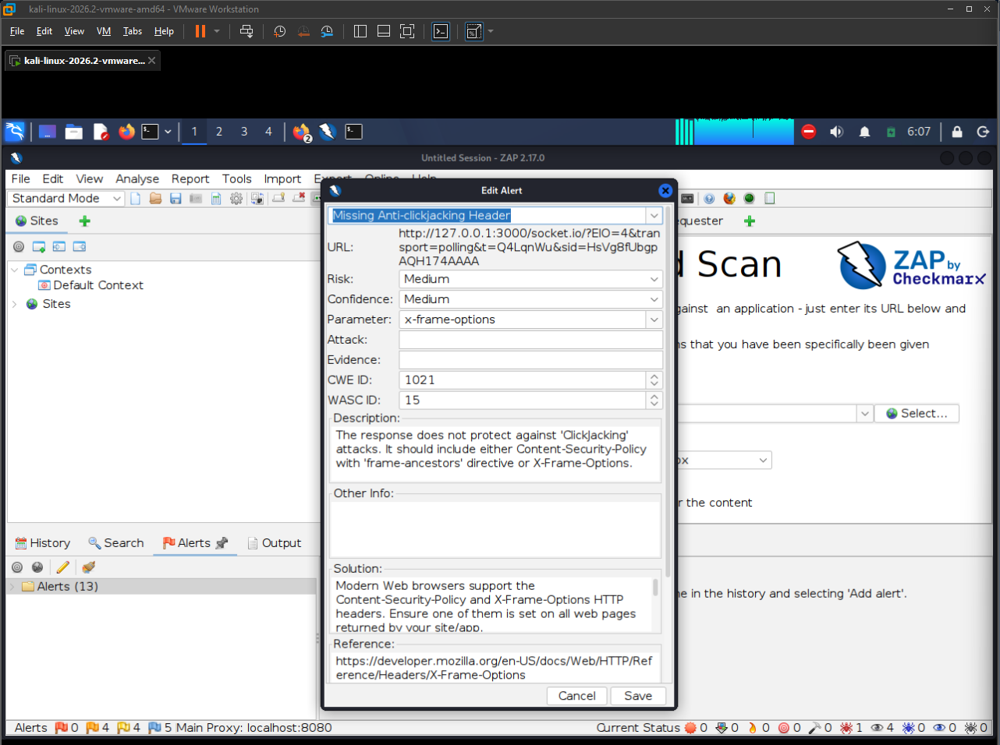
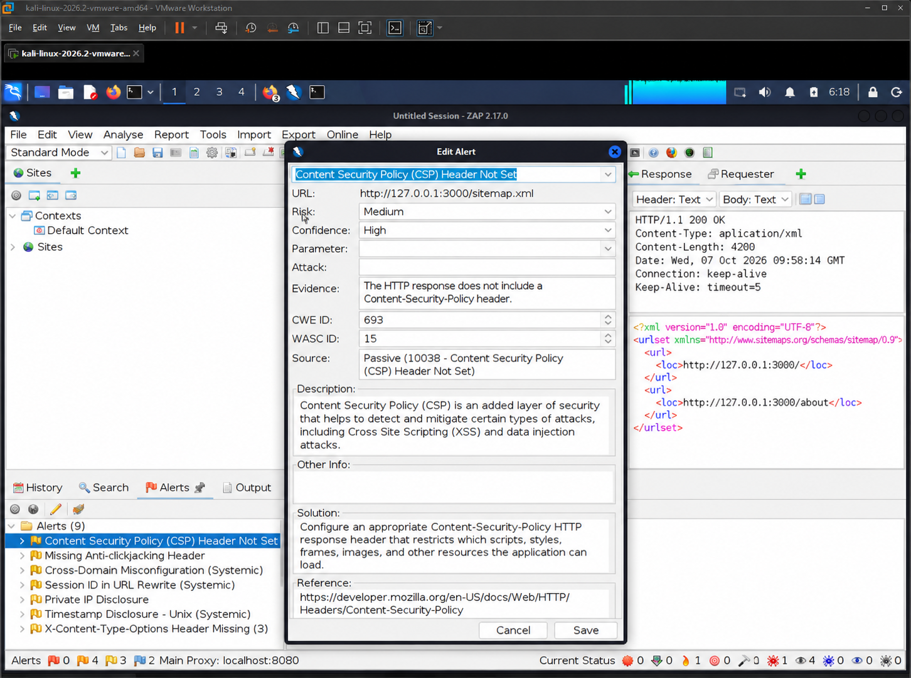

# Web Application Security Assessment Report — OWASP Juice Shop

**Author:** Rakesh Babriya
**Target:** OWASP Juice Shop (`http://127.0.0.1:3000`)
**Environment:** Isolated local laboratory (VMware + Kali Linux + Docker)
**Assessment Type:** Reconnaissance and passive web security analysis
**Date:** _[add date]_

---

## Table of Contents

1. [Executive Summary](#1-executive-summary)
2. [Objective](#2-objective)
3. [Scope and Authorization](#3-scope-and-authorization)
4. [Laboratory Environment](#4-laboratory-environment)
5. [Reconnaissance](#5-reconnaissance)
6. [HTTP Header Analysis](#6-http-header-analysis)
7. [Security Findings](#7-security-findings)
8. [Risk Summary](#8-risk-summary)
9. [Recommended Security Improvements](#9-recommended-security-improvements)
10. [Evidence Summary](#10-evidence-summary)
11. [Tools Used](#11-tools-used)
12. [Conclusion](#12-conclusion)
13. [Limitations](#13-limitations)
14. [References](#14-references)

---

## 1. Executive Summary

A security assessment was performed against **OWASP Juice Shop**, an intentionally vulnerable web application, running in an isolated and authorized local lab. The assessment covered service reconnaissance, HTTP response analysis, and passive security scanning.

**Three findings** were identified. All relate to missing HTTP security headers:

| # | Finding | Risk |
|---|---------|------|
| 1 | Missing Anti-clickjacking Header | Medium |
| 2 | Content Security Policy (CSP) Header Not Set | Medium |
| 3 | X-Content-Type-Options Header Missing | Low |

These are configuration weaknesses and are easy to fix. Each finding includes evidence, an explanation of the impact, and a recommended mitigation.

---

## 2. Objective

The objectives of this assessment were to:

- Identify exposed network services on the target system.
- Analyze HTTP responses for security-related headers.
- Identify security weaknesses using passive scanning.
- Document each finding with evidence, risk rating, and mitigation.
- Practice professional security reporting.

---

## 3. Scope and Authorization

| Item | Details |
|------|---------|
| In-scope target | `127.0.0.1` (local laboratory system) |
| In-scope service | OWASP Juice Shop on TCP port `3000` |
| Testing type | Reconnaissance and **passive** analysis |
| Authorization | Self-owned, intentionally vulnerable training application |
| Out of scope | Any external, third-party, or production system |

> All testing was restricted to the authorized local training environment.

---

## 4. Laboratory Environment

| Component | Purpose |
|-----------|---------|
| VMware | Hosts the isolated virtual lab |
| Kali Linux | Security testing platform |
| Docker | Runs the OWASP Juice Shop container |
| OWASP Juice Shop | Intentionally vulnerable target application |

The application was deployed in Docker and confirmed to be running before testing began.

**Evidence**



*Evidence 1: OWASP Juice Shop running in the local laboratory.*

---

## 5. Reconnaissance

Nmap was used to check whether the application port was reachable on the local target.

The scan confirmed that TCP port 3000 was open and returning HTTP/application data from the local Juice Shop instance.

**Result**

```text
3000/tcp open
```

The scan was restricted to `127.0.0.1`, which is the local laboratory system.

**Evidence**



*Evidence 2: Nmap reconnaissance confirming the open application port.*

---

## 6. HTTP Header Analysis

The HTTP response was analyzed using cURL:

```bash
curl -I http://127.0.0.1:3000
```

The response confirmed that the Juice Shop application was accessible and returned HTTP security-related headers.

The response included headers such as:

- `X-Content-Type-Options`
- `X-Frame-Options`
- `Content-Type`

OWASP ZAP was subsequently used to identify security-header issues in **individual application responses**. This matters because headers can differ between the main page and other resources such as API or Socket.IO responses.

**Evidence**



*Evidence 3: HTTP response headers collected using cURL.*

---

## 7. Security Findings

### Finding 1 — Missing Anti-clickjacking Header

| Property | Value |
|----------|-------|
| **Risk** | Medium |
| **Confidence** | Medium |
| **Affected Component** | HTTP response security header: `X-Frame-Options` |
| **Affected Resource** | A response associated with the Juice Shop application, including a Socket.IO endpoint |

**Description**

OWASP ZAP identified a response that did not provide adequate anti-clickjacking protection.

Clickjacking is a technique where an attacker attempts to embed a legitimate website or application inside another webpage and trick a user into interacting with the embedded content.

**Potential Impact**

A user could be tricked into clicking buttons or links on a hidden, framed copy of the application, performing actions they did not intend.

**Evidence**



*Evidence 4: OWASP ZAP reported a missing anti-clickjacking protection header.*

**ZAP Information**

| Property | Value |
|----------|-------|
| Alert | Missing Anti-clickjacking Header |
| Risk | Medium |
| Confidence | Medium |
| CWE | CWE-1021 |
| WASC | WASC-15 |
| Scanner | Passive Scanner |
| Parameter | `x-frame-options` |

**Recommended Mitigation**

Configure the application or web server to provide appropriate anti-clickjacking protection. For example:

```http
X-Frame-Options: SAMEORIGIN
```

Alternatively, where appropriate:

```http
Content-Security-Policy: frame-ancestors 'self'
```

The selected policy should match the application's legitimate requirements for embedding or framing.

---

### Finding 2 — Content Security Policy (CSP) Header Not Set

| Property | Value |
|----------|-------|
| **Risk** | Medium |
| **Confidence** | High |
| **Affected Component** | HTTP response security headers |
| **Affected Resource** | `http://127.0.0.1:3000/sitemap.xml` |

**Description**

OWASP ZAP identified a response that did not contain a Content-Security-Policy (CSP) header.

CSP provides an additional browser-side security layer by controlling which sources are permitted to load scripts, styles, images, frames, and other resources. A properly configured CSP can reduce the impact of certain attacks, including some Cross-Site Scripting (XSS) and content-injection scenarios.

**Potential Impact**

Without CSP, the browser has no policy to limit where scripts and other content can load from. If an injection flaw exists, an attacker has more freedom to run malicious content.

**Evidence**



*Evidence 5: OWASP ZAP reported that the Content Security Policy header was not set.*

**ZAP Information**

| Property | Value |
|----------|-------|
| Alert | Content Security Policy (CSP) Header Not Set |
| Risk | Medium |
| Confidence | High |
| CWE | CWE-693 |
| WASC | WASC-15 |
| Scanner | Passive Scanner |

**Recommended Mitigation**

Implement an appropriate Content Security Policy based on the application's legitimate resource requirements. For example, a starting policy could be:

```http
Content-Security-Policy: default-src 'self'
```

The final CSP should be carefully customized for the application's required scripts, styles, images, APIs, and other resources.

---

### Finding 3 — X-Content-Type-Options Header Missing

| Property | Value |
|----------|-------|
| **Risk** | Low |
| **Confidence** | Medium |
| **Affected Component** | HTTP response security header: `X-Content-Type-Options` |
| **Affected Resource** | Responses from the local Juice Shop application, including Socket.IO-related requests |

**Description**

OWASP ZAP reported that the `X-Content-Type-Options` header was missing from the affected response.

This header can help prevent browsers from MIME-sniffing responses and interpreting content as a different MIME type than the server declared.

**Potential Impact**

A browser may treat a file as a different content type than intended (for example, treating uploaded or served data as a script), which can enable content-based attacks.

**Evidence**


*Evidence 6: OWASP ZAP reported a missing X-Content-Type-Options header.*

**ZAP Information**

| Property | Value |
|----------|-------|
| Alert | X-Content-Type-Options Header Missing |
| Risk | Low |
| Confidence | Medium |
| CWE | CWE-693 |
| WASC | WASC-15 |
| Scanner | Passive Scanner |
| Parameter | `x-content-type-options` |

**Recommended Mitigation**

Configure the application or web server to return:

```http
X-Content-Type-Options: nosniff
```

This instructs supported browsers not to MIME-sniff the response.

---

## 8. Risk Summary

| Finding | Risk | Confidence |
|---------|------|------------|
| Missing Anti-clickjacking Header | Medium | Medium |
| Content Security Policy Header Not Set | Medium | High |
| X-Content-Type-Options Header Missing | Low | Medium |

### Overall Assessment

The assessment identified:

- **2 Medium-risk** findings
- **1 Low-risk** finding

The findings are primarily related to missing or insufficient HTTP security-header configurations. They should be addressed as part of the application's security hardening process.

---

## 9. Recommended Security Improvements

### 9.1 Anti-clickjacking Protection

Configure an appropriate anti-clickjacking control such as:

```http
X-Frame-Options: SAMEORIGIN
```

or an appropriate CSP `frame-ancestors` directive.

### 9.2 Content Security Policy

Implement a properly configured Content Security Policy based on the application's functionality and resource requirements.

### 9.3 MIME-Sniffing Protection

Configure:

```http
X-Content-Type-Options: nosniff
```

on applicable HTTP responses.

### 9.4 Security Header Review

Perform a broader review of HTTP security headers and ensure that security controls are consistently applied to **all** applicable application responses, not only the main page.

### 9.5 Verification After Fix

After applying the changes, re-run `curl -I http://127.0.0.1:3000` and repeat the ZAP scan to confirm the headers are present and the alerts no longer appear.

---

## 10. Evidence Summary

| Evidence | File | Description |
|----------|------|-------------|
| 1 | `01-juice-shop-running.png` | OWASP Juice Shop running in the local lab |
| 2 | `02-nmap-reconnaissance.png` | Nmap reconnaissance of port 3000 |
| 3 | `03-http-header-analysis.png` | HTTP response header analysis using cURL |
| 4 | `04-zap-anti-clickjacking.png.png` | Missing Anti-clickjacking Header finding |
| 5 | `05-zap-csp.png` | Content Security Policy Header Not Set finding |
| 6 | `6-zap-x-content-type-options.png.png` | X-Content-Type-Options Header Missing finding |

---

## 11. Tools Used

| Tool | Purpose |
|------|---------|
| VMware | Isolated laboratory environment |
| Kali Linux | Security testing environment |
| Docker | Deployment of OWASP Juice Shop |
| Nmap | Service and port reconnaissance |
| cURL | HTTP response/header analysis |
| OWASP ZAP | Web application security analysis |

---

## 12. Conclusion

A security assessment was successfully performed against an intentionally vulnerable OWASP Juice Shop application in an authorized local laboratory environment.

The assessment included reconnaissance using Nmap, HTTP analysis using cURL, and passive security analysis using OWASP ZAP.

Three security findings were documented:

1. Missing Anti-clickjacking Header — **Medium**
2. Content Security Policy Header Not Set — **Medium**
3. X-Content-Type-Options Header Missing — **Low**

Evidence was collected for each finding, and recommended mitigation measures were provided.

The assessment provided practical experience in reconnaissance, HTTP security-header analysis, vulnerability identification, evidence collection, risk assessment, and security documentation.

All testing was restricted to the authorized local training environment.

---

## 13. Limitations

- Only **passive** scanning was performed; no active attacks or exploitation were attempted.
- Findings are limited to HTTP security headers and do not represent a full penetration test.
- Results apply only to the tested local Juice Shop instance and its configuration at the time of testing.

---

## 14. References

- [OWASP Secure Headers Project](https://owasp.org/www-project-secure-headers/)
- [OWASP Juice Shop](https://owasp.org/www-project-juice-shop/)
- [OWASP ZAP](https://www.zaproxy.org/)
- [CWE-1021: Improper Restriction of Rendered UI Layers](https://cwe.mitre.org/data/definitions/1021.html)
- [CWE-693: Protection Mechanism Failure](https://cwe.mitre.org/data/definitions/693.html)